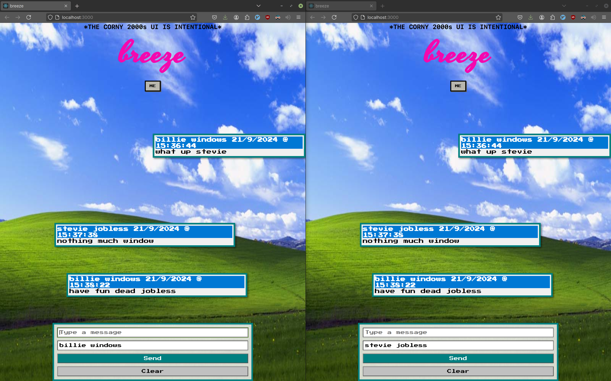

# Breeze

## Project Overview
Breeze is an interactive, real-time web application. It provides users with a unique way to explore and engage with their campus community.

## Key Features
- **2000s design elements**
- **public chat WITHOUT end-to-end encryption**
- **like discussion boards but without all the good stuff like actual content**
- **a place for goofs like me to hangout and make fun of authority together**
- **easter eggs**

## Technical Stack
- Frontend: ReactJS
- Backend: Socket.io and ExpressJS
- Map Rendering: Custom pixel art, some ui library(tailwind probably...)

## Hackathon Information
- Event: DevJams'24
- Date: 20 sept - 22 sept 2024
- Team: sapphire

## Challenges:
- The biggest design challenge was making the entire campus map into pixel art.
- AI tools weren't able to help, and we were not about to change the idea!
- Hence, we decided to recreate a small area of the campus instead of the entirety. 
- The next design challenge was assets. Designing everything by hand was taking too much time, so we decided to use some freely available assets.
- And we pivot....

---
- its a web application now.
- but still as good
- i'm constantly thinking of salvaging the project with code because the design team pretty much failed
- I think I will, if nothing else, maybe YOU guys can appreciate the quick thinking + godlike development speed on my part

## TODO List
- [x] Set up Reactproject structure
  - [x] Initialize new React project
  - [x] Set up necessary dependencies (React Native, Socket.io client)
- (got guys on this) -> they failed. terribly.
- [ ] Design and create 2D pixel art for campus map
  - [x] Sketch out campus layout
  - [ ] Create pixel art representations of buildings and areas
- [x] Set up backend server with Socket.io
  - [x] Create server structure
  - [x] Implement real-time message broadcasting
- [ ] improve the frontend
  - [ ] give the retro look
  - [ ] leave easter eggs
- [x] Integrate frontend and backend
  - [x] Connect React app to Socket.io server
  - [x] Test real-time updates across multiple devices
- [x] Implement user interface and styling
  - [x] Design and create UI components (buttons, text inputs, etc.)
  - [x] Apply consistent styling across the app
- [x] Fix any bugs or issues discovered

---

- [ ] ability to add photos
- [x] randomize the chat box appearance
- [x] retrofy the experience more
- [x] add goofy background for the lulz 2000s look
- [ ] add mouse pointer
- [ ] make the messages persistent
- [ ] deploy the socket server on render (i swore it ran perfectly before)
- [x] make the messages appear as bubbles(more as boxes)
